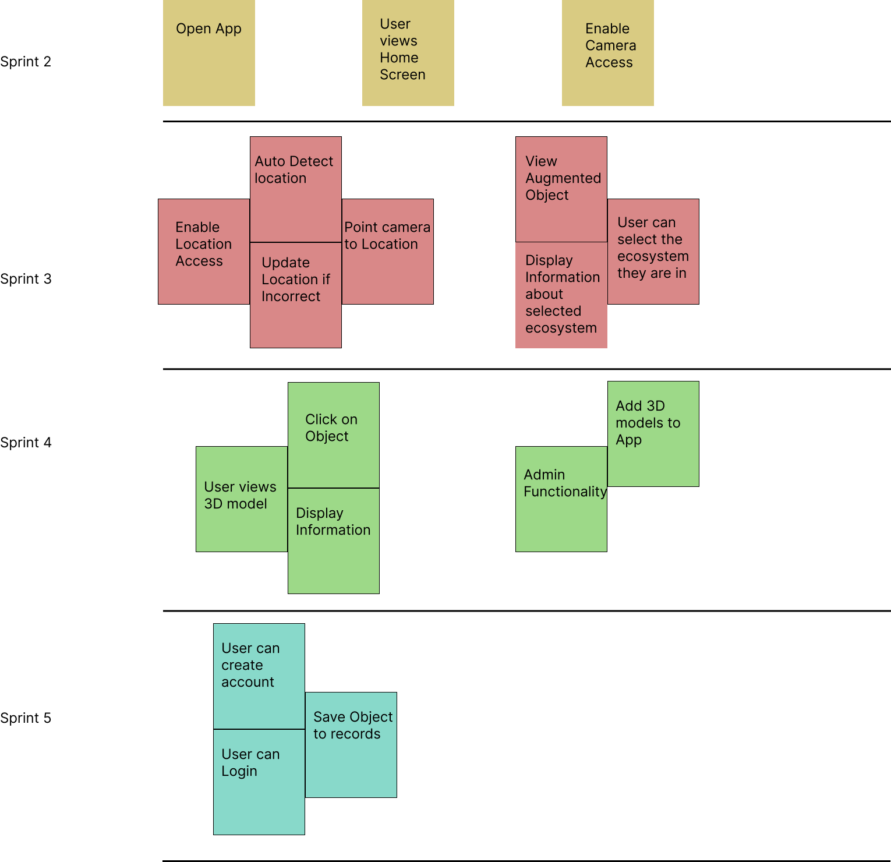

# Project Management

This page provides a general overview of the assigned tasks and roles for the duration of five sprints (subject to change).

## Story map

## Project Plan
### Sprint 1
*Due: January 28* 

**Tasks**

| **Task**        | **Related US** | **Assigned To** | **Due Date** |
| --------------- | ------------------- | -------------------- | ------------------------- |
| Project Summary and Glossary | Documentation | Kevin Sha | Jan 27 |
| User Stories | Documentation | Raunak Agarwal, Mohammad Hammad, Vaibhav Chugh | Jan 27 |
| Similar Products and Technical Sources | Documentation | Huy Ta | Jan 27 |
| Software Architecture and Sequence Diagram | Documentation | Yui Han | Jan 27 |
| UML Components and Class Models | Documentation | Mohammad Hammad | Jan 27 |
| Low Fidelity Wireframes| Documentation | Vaibhav Chugh | Jan 27 |
| Story Map | Documentation | Raunak Agarwal | Jan 27 |
| Project Planning | Documentation | Vaibhav Chugh | Jan 27 |
| Teamwork Docs | Documentation | Kevin Sha, Yui Han | Jan 27 |

### Sprint 2
*Due: February 11* 

**User Stories**

| **User Story** | **Story Points** |
| --------------- | ------------------- |
| SETUP - Setting up dev environment | 3 |
| US 01.01 - View Home Page| 1 |
| US 01.02 - GPS Location| 3 |
| US 01.03 - Edit and Confirm Location| 3 |

Estimated Sprint Velocity: **10**

**Tasks**

| **Task**        | **Related US** | **Assigned To** | **Due Date** |
| --------------- | ------------------- | -------------------- | ------------------------- |
| PostgreSQL Database Setup | SETUP | xyz | Feb xx |
| Django Models | SETUP | xyz | Feb xx |

### Sprint 3
*Due: March 4*

**User Stories**

| **User Story** | **Story Points** |
| --------------- | ------------------- |
| ... | ... |

Estimated Sprint Velocity: **...**

**Tasks**

Sprint 3 tasks will be added during Spring 2.

### Sprint 4
*Due: March 18*

**User Stories**

| **User Story** | **Story Points** |
| --------------- | ------------------- |
| ... | ... |

Estimated Sprint Velocity: **...**

**Tasks**

Sprint 4 tasks will be added during Spring 3.

### Sprint 5
*Due: April 4*

**User Stories**

| **User Story** | **Story Points** |
| --------------- | ------------------- |
| ... | ... |

Estimated Sprint Velocity: **...**

**Tasks**

Sprint 5 tasks will be added during Spring 4.