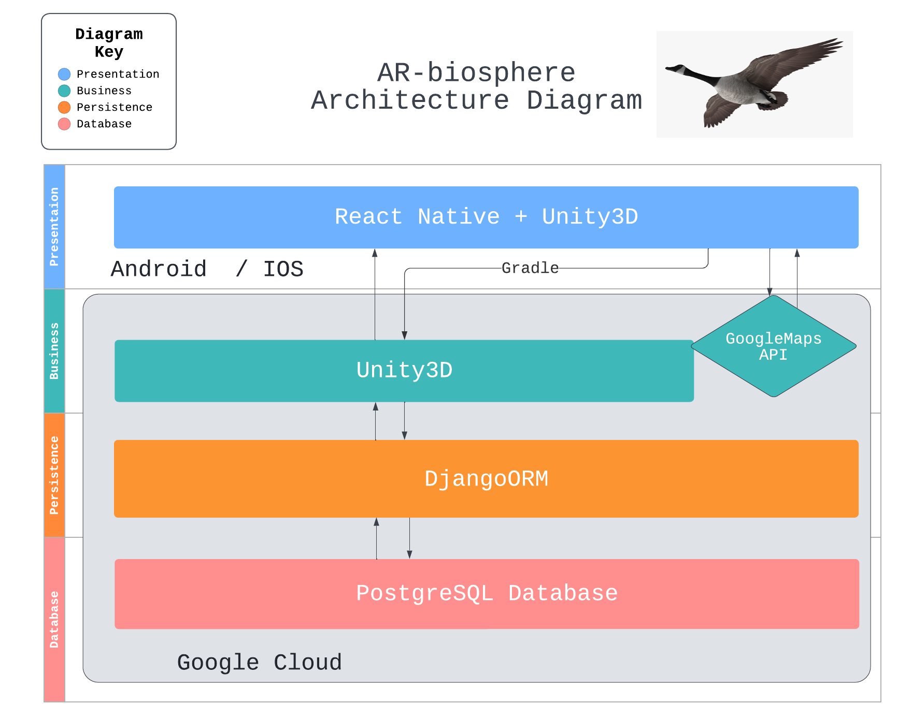

# Software Design

## Architecture Diagram

## Our project will use the N-tier layered architecture format, we plan on using React Native and Unity3D for the user interface layer, and the main logic of our app will be laid out in Unity3D. We will use Unity for rendering AR models through the AR Foundation Framework that allows adaptation to both Android and iOS without further changes. Tentatively, we want to use Django ORM as the persistence layer for accessing model data, and postgres data base for storing 3D models that we will use for the AR experience. This architecture diagram may be subjected to change in future sprints. 

