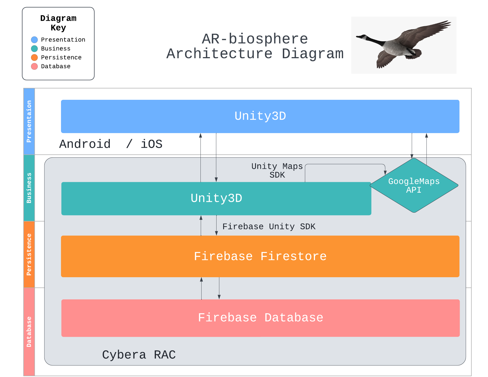

# Software Design

## Architecture Diagram

Our project will use the N-tier layered architecture format, we plan on using Unity3D for the user interface of the presentation layer, and the main logic of our app will be contained in Unity3D as well. Google Maps API will be used in the business layer to assist location detection. We will use Unity3D to access camera, detect surfaces, and build all AR related functionality through the AR Foundation Framework that allows adaptation to both Android and iOS without further changes. We want to use Firebase Firestore as the persistence layer for accessing AR model data, and a Firestore database for storing 3D models that we will use for the AR experience. Currently we plan on hosting the backend database on a Google Cloud server.

## UML Class Diagram

Our app can be divided into a number of central classes along with some helper ones. The user class makes calls that get the app user up and running like making calls that obtain the user's current location using the Location class (which further makes use of the class GeocoderResult that Google Maps API uses). The Camera class is responsible for displaying AR objects (which are classed as ARObject). ARObjects are heavily reliant on x, y, and z coordinates, which is why having a 3D vector class, Vector3, is convenient.

## Sequence Diagram

The sequence diagram features the four most important interactions in our app: login, location recognition, camera view, and information view. From opening the app, users may choose to login. After which, all users must set their location either automatically through a built in maps API, or manually enter their location if the GPS is incorrect. Once location is set, users will be navigated to their camera view that allows them to point their camera at aquatic objects in order to see an AR of said object on screen. Users may view information about objects by clicking on them, where they may choose to navigate further to external Wiki sites through embedded links. Users may choose to save objects to their account database, if logged in. 

## Low-Fidelity User Interface 

[Wireframes](https://balsamiq.com/learn/articles/what-are-wireframes/) are used to show the overall look and feel of your app, as well as the high-level user-interaction design. Looking at the wireframes, anyone should be able to get an idea of what will be developed. Low fidelity wireframes are just a quick sketch that can make ideas more tangible. They are focused on the “big picture” of the project.

Wireframes for this project were made using [Balsamiq](https://balsamiq.com/). They provide a clear overview of the app structure, layout, information architecture, user flow, functionality, and intended behaviors.

