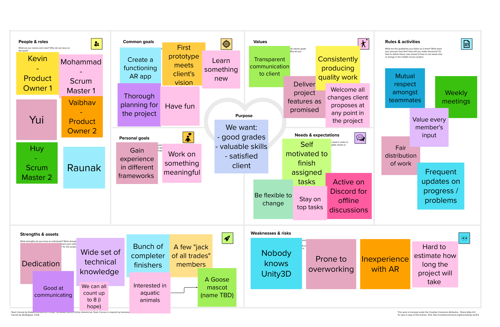

# Team Work

## Team Canvas
Below is the team canvas for our team

## Belbin Roles
See [https://www.belbin.com/about/belbin-team-roles](https://www.belbin.com/about/belbin-team-roles).

| **Name**        | **Preferred Roles** | **Manageable Roles** | **Least Preferred Roles** |
| --------------- | ------------------- | -------------------- | ------------------------- |
| Mohammad Hammad | IMP, CF, SP         | PL, TW, ME           | SH, RI, CO                |
| Raunak Agarwal  | SH, RI, IMP         | CO, PL, SP           | ME, TW, CF                |
| Vaibhav Chugh   | CO, IMP, CF         | ME, RI, SP           | SH, PL, TW                |
| Yui Han        | ME, IMP, CF         | SP, PL, SH           | RI, TW, CO                |
| Huy Ta          | CF, CO, TW          | SP, IMP, ME          | PL, SH, RI                |
| Kevin Sha       | PL, ME, IMP         | SH, SP, CF           | RI, CO, TW                |

### Thinking Roles

#### PL (Plant)

> Tends to be highly creative and good at solving problems in unconventional ways.

| **Preferred** | **Manageable**  |
| ------------- | --------------- |
| Kevin Sha     | Mohammad Hammad |
|               | Raunak Agarwal  |
|               | Yui Han        |

#### ME (Monitor Evaluator)

> Provides a logical eye, making impartial judgements where required and weighs up the team's options in a dispassionate way.

| **Preferred** | **Manageable**  |
| ------------- | --------------- |
| Yui Han      | Mohammad Hammad |
| Kevin Sha     | Vaibhav Chugh   |
|               | Huy Ta          |

#### SP (Specialist)

> Brings in-depth knowledge of a key area to the team.

| **Preferred**   | **Manageable**  |
| --------------- | --------------- |
| Mohammad Hammad | Raunak Agarwal  |
|                 | Vaibhav Chugh   |
|                 | Yui Han        |
|                 | Huy Ta          |
|                 | Kevin Sha       |

### Action Roles

#### SH (Shaper)

> Provides the necessary drive to ensure that the team keeps moving and does not lose focus or momentum.

| **Preferred**   | **Manageable**  |
| --------------- | --------------- |
| Raunak Agarwal  | Yui Han         |
|                 | Kevin Sha       |

#### IMP (Implementer)

> Needed to plan a workable strategy and carry it out as efficiently as possible.

| **Preferred**   | **Manageable**  |
| --------------- | --------------- |
| Mohammad Hammad | Huy Ta          |
| Vaibhav Chugh   |                 |
| Raunak Agarwal  |                 |
| Yui Han        |                 |
| Kevin Sha       |                 |

#### CF (Completer Finisher)

> Most effectively used at the end of tasks to polish and scrutinise the work for errors, subjecting it to the highest standards of quality control.

| **Preferred**   | **Manageable**  |
| --------------- | --------------- |
| Mohammad Hammad | Kevin Sha       |
| Vaibhav Chugh   |                 |
| Yui Han        |                 |
| Huy Ta          |                 |

### People Roles

#### RI (Resource Investigator)

> Uses their inquisitive nature to find ideas to bring back to the team. 

| **Preferred**  | **Manageable**  |
| -------------- | --------------- |
| Raunak Agarwal | Vaibhav Chugh   |

#### TW (Teamworker)

> Helps the team to gel, using their versatility to identify the work required and complete it on behalf of the team.

| **Preferred** | **Manageable**  |
| ------------- | --------------- |
| Huy Ta        | Mohammad Hammad |

#### CO (Co-ordinator)

> Needed to focus on the team's objectives, draw out team members and delegate work appropriately.

| **Preferred** | **Manageable**  |
| ------------- | --------------- |
| Vaibhav Chugh | Raunak Agarwal  |
| Huy Ta        |                 |
